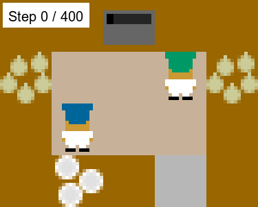
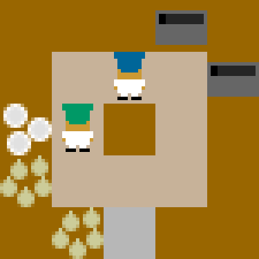
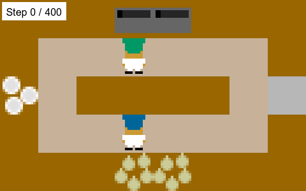

# Multi-Agent Reinforcement Learning in Overcooked

Developed a Multi-Agent Proximal Policy Optimization (MAPPO) system in PyTorch to train two cooperative agents in the Overcooked environment. The system uses centralized training with decentralized execution, with a shared policy network for both agents and a centralized value function that evaluates the joint state.

**Author:** Abukar Aweis

> This project was completed as part of Georgia Tech's CS 7642: Reinforcement Learning course. The Overcooked environment and supporting framework were provided by the course and are not included in this repository. I implemented the MAPPO algorithm and neural network architecture used for training and evaluation, and I wrote the accompanying project report.

## Results

The trained MAPPO agents exceeded the target performance threshold of 7 soups delivered per episode on all three required Overcooked layouts.

- **Cramped Room:** 8.8 average soups delivered per episode
- **Coordination Ring:** 7.8 average soups delivered per episode
- **Counter Circuit:** 7.3 average soups delivered per episode

The three environments required progressively more training, with the final policies trained for approximately 7,000, 38,000, and 85,000 episodes, respectively.

## How It Works

The project uses a MAPPO-style actor-critic architecture for cooperative multi-agent reinforcement learning:

1. Each agent receives its own 96-dimensional observation of the environment.
2. A shared policy network maps each local observation to a distribution over six discrete actions.
3. Both agents act independently using the shared policy during execution.
4. During training, a centralized value function evaluates the combined 192-dimensional observations of both agents.
5. Trajectories are collected from both agents and used to compute rewards-to-go and advantage estimates.
6. The policy is updated using the PPO clipped objective with entropy regularization, while the centralized critic is trained to predict returns.
7. The process repeats over many episodes until the agents learn cooperative behavior that consistently completes soup deliveries.

## Implementation

### `mappo.py`

Contains the core MAPPO training and evaluation logic, including:

- trajectory collection for both agents
- rewards-to-go and advantage estimation
- PPO clipped policy updates
- entropy regularization
- centralized value-function training
- training metrics and evaluation logic

### `neural_networks.py`

Defines the neural network architecture used by the actor and critic:

- shared policy network for both agents
- centralized value-function network
- fully connected layers with LayerNorm and ReLU activations

### `main.py`

Handles experiment configuration and execution, including:

- Overcooked environment creation
- layout-specific training settings
- loading and saving trained policies
- running training and evaluation
- generating final metrics and outputs

### `gen_outputs.py`

Handles experiment output and visualization utilities, including:

- plotting training and evaluation metrics
- generating performance graphs
- formatting and saving experiment logs
- organizing output files for analysis

## Visualizations

The animations below show the trained MAPPO agents completing full episodes in each of the three Overcooked layouts.

### Cramped Room

  

### Coordination Ring

  

### Counter Circuit

  

## Technologies

- Python
- PyTorch
- NumPy
- Gym
- Overcooked-AI
- Multi-Agent Reinforcement Learning
- Proximal Policy Optimization (PPO)
- Centralized Training with Decentralized Execution (CTDE)

## Limitations

The learned policies are specialized to the three Overcooked layouts used during training and were not evaluated for transfer to unseen layouts. Training also required a large number of environment interactions, especially for the more complex Coordination Ring and Counter Circuit layouts.

Because the agents share a policy, their behavior can still emerge differently from one another, but the approach does not explicitly model communication between agents or guarantee optimal task specialization.

## Report

A detailed discussion of the MAPPO implementation, training process, experimental results, and agent behavior is available in the [project report](MAPPO-Overcooked-Report.pdf).